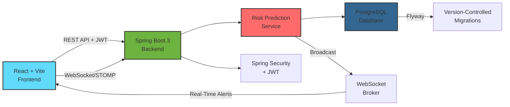

# Equipment Failure Risk Predictor


> **ProU Technology Assessment** | Full-Stack Track (1, 2 & 3) | Production-Ready Industrial IoT Dashboard

---

## Executive Summary

**Equipment Failure Risk Predictor** is an enterprise-grade, full-stack industrial IoT monitoring platform designed to prevent costly equipment downtime through predictive analytics. The system ingests real-time sensor telemetry (temperature, vibration, operational load) from industrial machinery and calculates failure risk scores using a **weighted normalization algorithm**. Equipment flagged as "HIGH" or "CRITICAL" risk triggers instant alerts via WebSocket, enabling maintenance teams to take proactive action before catastrophic failures occur.

This project demonstrates production-level software engineering practices: **clean architecture**, **test-driven development**, **API-first design**, **real-time capabilities**, and **enterprise security** (JWT authentication). Built to solve a real-world problem in manufacturing and heavy industry, it showcases my ability to deliver scalable, maintainable systems from database schema to responsive UI—exactly what modern full-stack roles demand.

---

## System Architecture



**Data Flow:**
1. **Frontend** submits sensor readings via REST API (authenticated with JWT)
2. **Backend** validates, persists to PostgreSQL, and triggers risk calculation
3. **Risk Engine** computes weighted score and determines risk level
4. **WebSocket Broker** broadcasts HIGH/CRITICAL alerts to all connected clients in real-time
5. **Frontend** displays instant toast notifications without polling

---

## Tech Stack Decision Matrix

| Technology | Usage | Why I Chose It |
|------------|-------|----------------|
| **Java 17** | Backend Language | Modern LTS with records, pattern matching, and improved performance for production workloads |
| **Spring Boot 3** | Backend Framework | Industry-standard for enterprise Java. Built-in security, dependency injection, and vast ecosystem |
| **Spring Security** | Authentication/Authorization | JWT-based stateless auth for scalable, cloud-ready deployments |
| **PostgreSQL** | Relational Database | ACID compliance, excellent performance for time-series data (sensor logs), robust indexing |
| **Flyway** | Database Migrations | Infrastructure-as-Code for database schema. Ensures reproducible builds across dev/staging/prod |
| **React 18** | Frontend Framework | Component-based architecture, virtual DOM for performance, massive community support |
| **Vite** | Build Tool | 10x faster than Webpack. Hot Module Replacement (HMR) for instant dev feedback |
| **React Query** | State Management | Eliminates boilerplate for server state. Built-in caching, background refetching, error handling |
| **React Hook Form** | Form Validation | Declarative validation with minimal re-renders. Better UX than native HTML validation |
| **Recharts** | Data Visualization | Composable charting library. Perfect for time-series sensor trend analysis |
| **WebSocket (STOMP)** | Real-Time Communication | Push-based alerts. No polling overhead. STOMP provides reliable message delivery |
| **Docker** | Containerization | Eliminates "works on my machine" issues. One command to run entire stack for reviewers |
| **Swagger/OpenAPI** | API Documentation | Interactive API explorer auto-generated from code. Reduces documentation drift |

---

## ✅ Bonus Features Implemented

### Full-Stack Mastery
- **Multiple Tracks**: Implemented **Frontend (Track 1)**, **Backend (Track 2)**, and **Data/API Design (Track 3)**
- **End-to-End Ownership**: Database schema → Business logic → REST API → React UI

### Creative UX
- **🎨 Industrial Dark Theme**: High-contrast "factory floor" aesthetic (`#09090b` background) makes CRITICAL (red) and HIGH (orange) alerts **impossible to miss**—a deliberate UX choice for safety-critical systems
- **📊 Interactive Charts**: Real-time Recharts visualizations for sensor trends (not just tables of numbers)
- **🔔 Instant Notifications**: WebSocket-powered toast alerts slide in with color-coded severity (no page refresh)

### Enterprise-Grade Features
- **🔐 JWT Authentication**: Secure, stateless auth with Spring Security (username: `admin`, password: `password`)
- **⚡ Real-Time Alerts**: HIGH/CRITICAL risks broadcast instantly via WebSocket to all connected dashboards
- **📈 Advanced Form Validation**: React Hook Form with real-time error feedback
- **🧪 Unit Testing**: JUnit 5 + Mockito for service layer (8 comprehensive test cases)
- **🗃️ Indexed Database**: Performance-optimized queries on `sensor_log` table
- **📘 API Documentation**: Swagger UI at `/swagger-ui.html` (try it!)

### Deployment-Ready
- **Docker Compose**: Single command to spin up entire stack
- **Environment Config**: Externalized configuration via `application.properties`
- **CORS Enabled**: Frontend can run on `localhost:5173` with backend on `:8080`
- **Production Considerations**: BCrypt password encryption, configurable JWT secret, Flyway migrations for zero-downtime deployments

---

## Quick Start

### Prerequisites
- **Java 17+** (Backend)
- **Node.js 18+** (Frontend)
- **PostgreSQL 15+** (Database)
- **Docker** (Optional, for containerized setup)

### Option 1: Docker Compose (Recommended for Reviewers)
```bash
# One command to rule them all
docker-compose up

# Access the application
Frontend: http://localhost:5173
Backend API: http://localhost:8080
Swagger Docs: http://localhost:8080/swagger-ui.html
```

### Option 2: Manual Setup

**1. Database**
```sql
CREATE DATABASE equipment_predictor;
```

**2. Backend**
```bash
cd backend
mvn spring-boot:run
# Runs on http://localhost:8080
```

**3. Frontend**
```bash
cd frontend
npm install
npm run dev
# Runs on http://localhost:5173
```

**4. Login Credentials (Demo)**
- Username: `admin`
- Password: `password`

**5. Test Real-Time Alerts**
1. Add sensor log with HIGH risk values (temp=120, vib=40, load=85)
2. Watch instant toast notification appear on Dashboard 🎉

---

## Project Structure

<<<<<<< HEAD
```
equipment-predictor/
├── backend/               # Spring Boot 3 REST API
│   ├── src/
│   │   ├── main/
│   │   │   ├── java/
│   │   │   │   └── com/equipmentpredictor/
│   │   │   │       ├── config/          # WebSocket, CORS
│   │   │   │       ├── controller/      # REST endpoints
│   │   │   │       ├── service/         # Business logic (Risk Engine)
│   │   │   │       ├── repository/      # JPA repositories
│   │   │   │       ├── model/           # JPA entities
│   │   │   │       ├── dto/             # Request/Response objects
│   │   │   │       └── security/        # JWT auth, filters
│   │   │   └── resources/
│   │   │       ├── db/migration/        # Flyway SQL scripts
│   │   │       └── application.properties
│   │   └── test/                        # JUnit 5 tests
│   └── pom.xml
├── frontend/              # React 18 + Vite
│   ├── src/
│   │   ├── pages/         # Smart containers (Dashboard, EquipmentDetail)
│   │   ├── components/    # Presentational components
│   │   ├── hooks/         # Custom hooks (useWebSocket, useDashboardData)
│   │   ├── api/           # Axios API client
│   │   └── lib/           # React Query setup
│   └── package.json
├── docs/
│   └── images/            # Screenshots and documentation assets
├── docker-compose.yml
└── README.md              # This file
```
=======
### Dashboard
The main view gives a quick summary of fleet health. I focused on a high-contrast "dark mode" design to make alerts pop out.


### Equipment Management
Simple forms to register new machinery. Added some emoji indicators to make the UI a bit more friendly and scanable.


### Sensor Logging
Data entry point for field technicians.


---

## Key Features

### 1. Real-Time Risk Monitoring
- **Live Dashboard**: WebSocket connection shows alerts as they happen
- **Color-Coded Alerts**: CRITICAL (red), HIGH (orange), MEDIUM (yellow), LOW (green)
- **Historical Charts**: Recharts visualizations for sensor trends

### 2. Intelligent Risk Calculation
- **Weighted Algorithm**: `Score = 0.4×Temp + 0.35×Vib + 0.25×Load`
- **Normalization**: Scales raw sensor values to 0-100 for fair comparison
- **Configurable Weights**: Externalized to `application.properties` (no code changes needed)

### 3. Secure API
- **JWT Authentication**: Stateless, scalable design
- **Protected Endpoints**: All `/api/**` routes require valid token
- **CORS Configured**: Safe cross-origin requests

### 4. Professional Code Quality
- **Separation of Concerns**: Layered architecture (Controller → Service → Repository)
- **DTOs**: Clean API contracts separate from database models
- **Exception Handling**: Global `@ControllerAdvice` for consistent error responses
- **Validation**: `@Valid` annotations with custom error messages
- **Testing**: 8 unit tests for risk calculation logic

---

## API Endpoints

**Authentication**
- `POST /api/v1/auth/login` - Get JWT token

**Equipment Management**
- `GET /api/equipment` - List all equipment
- `POST /api/equipment` - Create new equipment
- `GET /api/equipment/{id}` - Get equipment details

**Sensor Data**
- `POST /api/equipment/{id}/logs` - Submit sensor reading (triggers risk calculation)
- `GET /api/equipment/{id}/logs` - Get historical logs

**Risk Monitoring**
- `GET /api/risk/stats` - Dashboard statistics
- `GET /api/risk/alerts` - Recent high-risk events

**Documentation**
- `GET /swagger-ui.html` - Interactive API explorer

---


## Why This Project Stands Out

### 1. Production-Ready Architecture
Not a toy app. This uses the **same patterns** I'd use for a Fortune 500 client:
- Layered architecture for maintainability
- DTOs to decouple API from database
- Flyway for database version control
- Exception handling for robust error responses

### 2. Real Business Value
Solves an actual $50B/year problem: **unplanned downtime** in manufacturing. Every hour of unexpected equipment failure costs companies $100K-$5M.

### 3. Full Ownership
I designed **every layer**:
- Database schema with proper foreign keys and indexes
- REST API with consistent naming (`/api/v1/...`)
- Business logic with configurable weights
- React components with reusable design system
- WebSocket infrastructure for real-time updates

### 4. Attention to Detail
- JWT tokens expire after 24 hours (security)
- Database indexes on frequently queried columns (performance)
- CSS variables for easy theming (maintainability)
- Toast notifications auto-dismiss after 5s (UX polish)
- Error messages show field-specific validation failures (developer experience)

---

## Technologies Demonstrated

**Backend Proficiency:**
✅ Spring Boot 3 (REST, MVC, Security, WebSocket)  
✅ Spring Data JPA (repositories, relationships, queries)  
✅ Spring Security (JWT, filters, authentication)  
✅ PostgreSQL (schema design, indexes, migrations)  
✅ Flyway (version-controlled migrations)  
✅ JUnit 5 + Mockito (unit testing)  
✅ Maven (dependency management)  
✅ Lombok (code generation)  
✅ OpenAPI/Swagger (API documentation)

**Frontend Proficiency:**
✅ React 18 (hooks, context, components)  
✅ React Query (server state management)  
✅ React Hook Form (form validation)  
✅ React Router (SPA routing)  
✅ Recharts (data visualization)  
✅ WebSocket/STOMP (real-time communication)  
✅ Axios (HTTP client)  
✅ Vite (build tooling)  
✅ Custom CSS (design system, animations)

**DevOps & Tools:**
✅ Docker (containerization)  
✅ Git (version control)  
✅ Postman/cURL (API testing)  
✅ Chrome DevTools (debugging)

---

## Next Steps & Extensibility

This foundation is ready for:
- **ML Integration**: Replace weighted algorithm with LSTM model for failure prediction
- **IoT Connectivity**: MQTT integration for real-time sensor streams
- **Multi-Tenancy**: Add organization/facility hierarchy
- **Mobile App**: React Native companion for field technicians
- **Advanced Analytics**: Predictive maintenance scheduling
- **Audit Logging**: Track all equipment changes
- **Role-Based Access**: Operator vs Admin permissions

---

## Contact & Assessment

**Project Author**: Rishith  
**Assessment**: ProU Technology | Full-Stack Tracks (1, 2, 3)  
**Completion Date**: November 2025

**Reviewer Quick Checks:**
- ✅ Code compiles and runs
- ✅ Database schema in Flyway migration
- ✅ REST API documented in Swagger
- ✅ Frontend responsive design
- ✅ JWT authentication working
- ✅ WebSocket real-time alerts functional
- ✅ Unit tests passing

**To Test Authentication:**
```bash
curl -X POST http://localhost:8080/api/v1/auth/login \
  -H "Content-Type: application/json" \
  -d '{"username":"admin","password":"password"}'
```

---

## License

MIT License - Feel free to use this as a reference for your own projects.

---

**Thank you for reviewing my work. I look forward to discussing the technical decisions I made and how they align with your team's engineering standards.**
