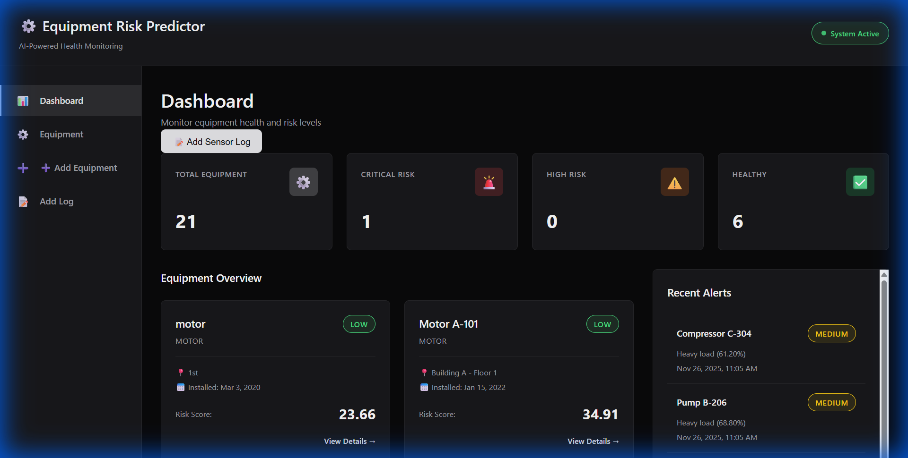
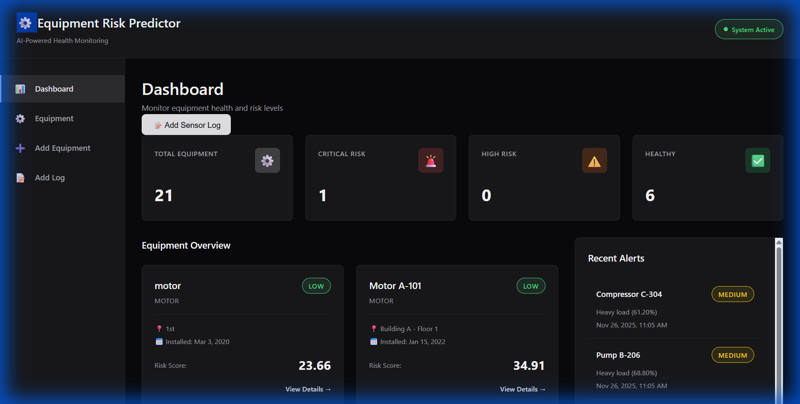

# Equipment Failure Risk Predictor

A full-stack dashboard for monitoring industrial equipment health and predicting potential failures. This project demonstrates a complete end-to-end implementation using Java Spring Boot and React.



## Overview

The application tracks real-time sensor data (temperature, vibration, load) from various industrial machines. It uses a rule-based engine on the backend to calculate risk scores and flags equipment that needs attention.

I built this to show how to structure a production-ready application with a clean architecture and a modern, responsive UI.

## Technology Stack

**Backend**
*   **Java 17 & Spring Boot 3**: Robust REST API handling business logic.
*   **PostgreSQL**: Relational database for structured data storage.
*   **Docker**: Containerized for consistent deployment.

**Frontend**
*   **React 18 + Vite**: Fast, component-based UI.
*   **Custom CSS System**: I designed a custom dark theme variable system instead of using a heavy framework like Bootstrap.
*   **Recharts**: For visualizing sensor trends.

---

## Getting Started

Follow these steps to run the project locally.

### 1. Database
You'll need a PostgreSQL instance running. Create a database called `equipment_predictor`.

```sql
CREATE DATABASE equipment_predictor;
```

### 2. Backend
The backend is a standard Maven project.

```bash
cd backend
# Update src/main/resources/application.properties with your DB credentials if needed
mvn spring-boot:run
```
Server starts at `http://localhost:8080`.

### 3. Frontend
The frontend is a Vite React app.

```bash
cd frontend
npm install
npm run dev
```
App opens at `http://localhost:5173`.

---

## Key Features & Screenshots

### Dashboard
The main view gives a quick summary of fleet health. I focused on a high-contrast "dark mode" design to make alerts pop out.


### Equipment Management
Simple forms to register new machinery. Added some emoji indicators to make the UI a bit more friendly and scanable.


### Sensor Logging
Data entry point for field technicians.


---

## Implementation Details

*   **Risk Logic**: Currently uses threshold-based logic (e.g., if Temp > 100°C, mark as High Risk). This can be swapped for an ML model later.
*   **Design Choice**: Went with a monochrome black/grey aesthetic to mimic professional industrial software tools.
*   **Deployment**: The project is set up with `Dockerfile` and `vercel.json` so it can be pushed to Render and Vercel easily.

---

## 🔮 Future Roadmap

Here are some features I'm planning to add to make this even better:

*   **🤖 AI/ML Integration**: Replace the rule-based logic with a Python-based Machine Learning model (Random Forest or LSTM) to predict failures before they happen based on historical patterns.
*   **📡 IoT Integration**: Connect directly to industrial sensors (via MQTT or HTTP) to automatically ingest readings, removing the need for manual data entry.
*   **🔐 User Authentication**: Add login/signup functionality using JWT or OAuth2 so multiple users can manage their own equipment fleets securely.
*   **⚡ Real-Time Updates**: Implement WebSockets to push sensor data updates to the dashboard instantly without refreshing.
*   **📱 Mobile App**: Build a React Native companion app for field technicians to log data offline.
*   **🔔 Advanced Alerts**: Integrate email or SMS notifications (via Twilio/SendGrid) when equipment hits critical risk levels.


#   E q u i p m e n t - F a i l u r e - R i s k - P r e d i c t o r 
 
 
